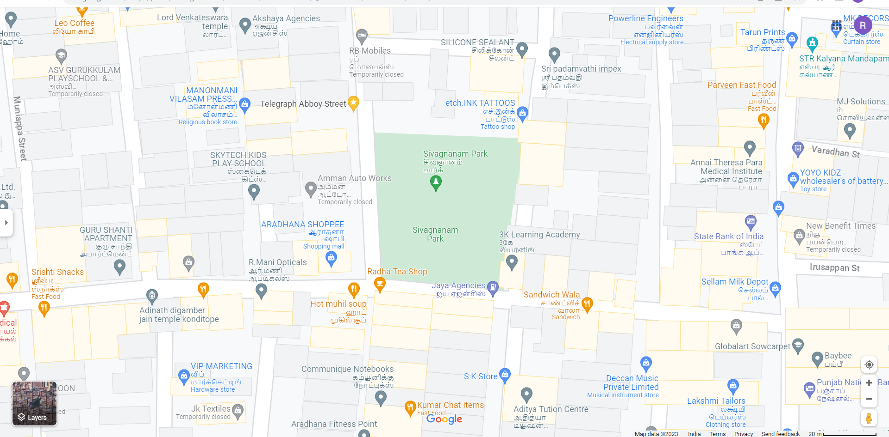
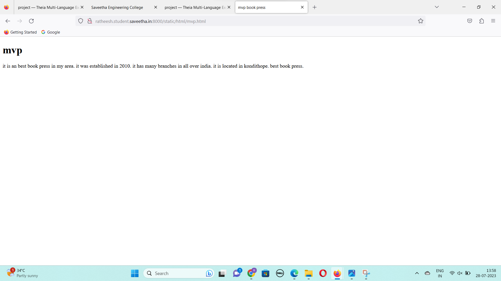
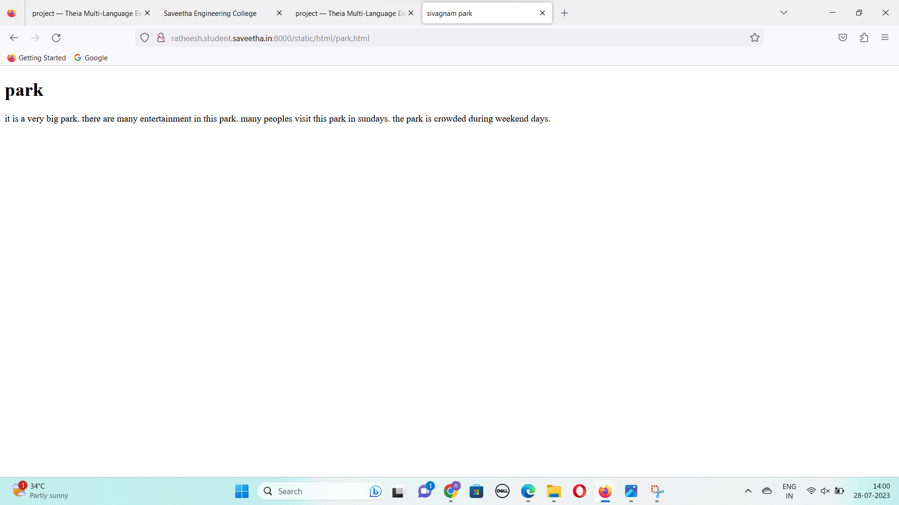
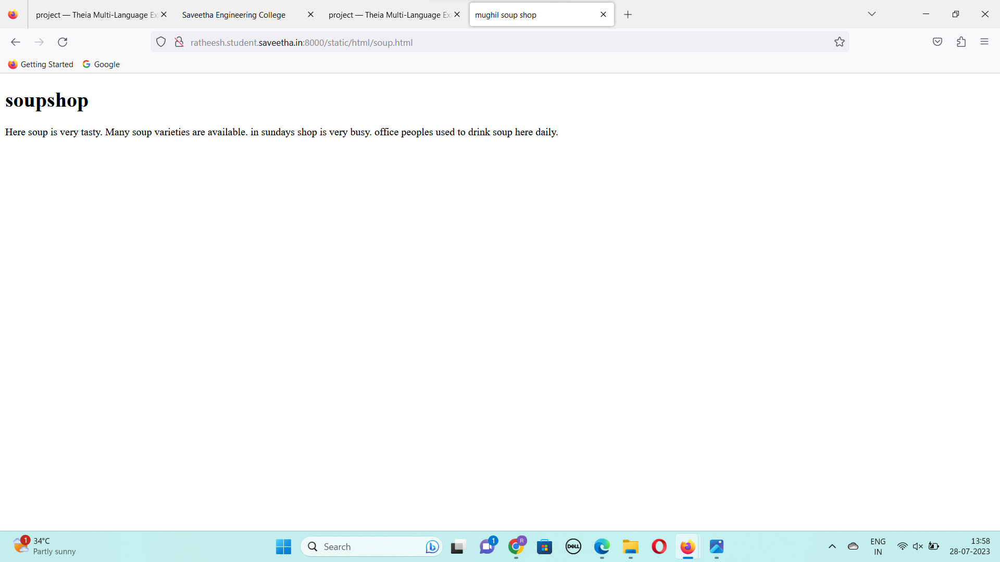
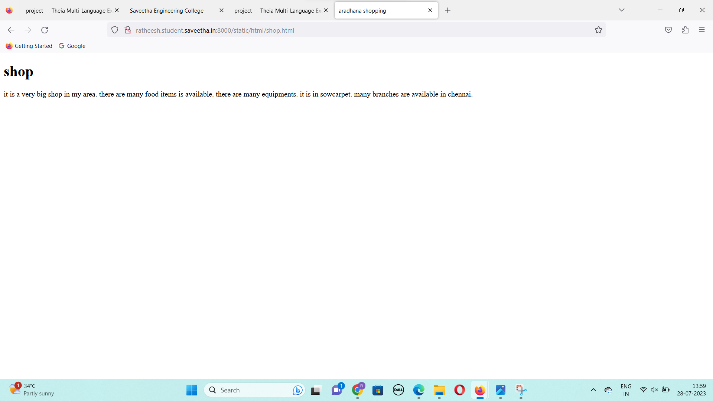
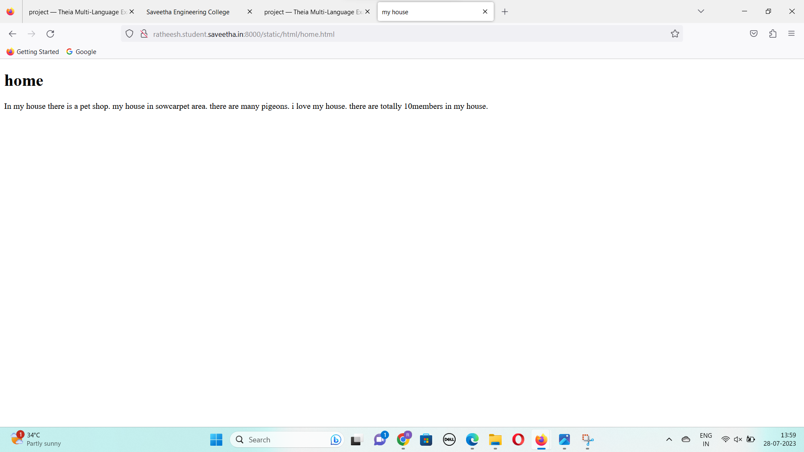

# Places Around Me
## AIM:
To develop a website to display details about the places around my house.

## Design Steps:

### Step 1:
upload the html text of the placesaround .
### Step 2:
now run the server and take the screenshot of the outputs.

## Code:
``
<!DOCTYPE html>
<html>
    <head>
        <title>places around me</title>
    </head>
<body>

<map name="image-maps-2023-07-27-090006" id="/static/images/map.png">
<area  alt="" title="mvp" href="/static/html/mvp.html" shape="rect" coords="194,146,292,208" style="outline:none;" target="_self"     />
<area  alt="" title="" href="/static/html/shop.html" shape="rect" coords="210,276,354,338" style="outline:none;" target="_self"     />
<area  alt="" soup="" href="/static/html/soup.html" shape="rect" coords="80,160,196,254" style="outline:none;" target="_self"     />
<area  alt="" park="" href="/static/html/park.html" shape="rect" coords="192,70,360,136" style="outline:none;" target="_self"     />
<area  alt="" home="" href="/static/html/home.html" shape="rect" coords="358,238,486,294" style="outline:none;" target="_self"     />
<area shape="rect" coords="585,368,587,370" alt="Image Map" style="outline:none;" title="Image Map" href="map.png/" />
</map>
</body>
</html>

## mvp.html:

<!DOCTYPE html>
<html>
<head>
    <title>mvp book press</title>
</head>
<body>
    <h1>mvp</h1>

    it is an best book press in my area.
    it was established in 2010.
    it has many branches in all over india.
    it is located in kondithope.
    best book press.

</body>
</html>

## park.html:

<!DOCTYPE html>
<html>
<head>
    <title>sivagnam park</title>
</head>
<body>
    <h1>park</h1>

 it is a very big park.
 there are many entertainment in this park.
 many peoples visit this park in sundays.
 the park is crowded during weekend days.

</body>
</html>

## shop.html:

<!DOCTYPE html>
<html>
<head>
    <title>aradhana shopping</title>
</head>
<body>
    <h1>shop</h1>

  it is a very big shop in my area.
  there are many food items is available.
  there are many equipments.
  it is in sowcarpet.
  many branches are available in chennai.

</body>
</html>

## soup.html:

<!DOCTYPE html>
<html>
<head>
    <title>mughil soup shop</title>
</head>
<body>
    <h1>soupshop</h1>

    Here soup is very tasty.
    Many soup varieties are available.
    in sundays shop is very busy.
    office peoples used to drink soup here daily.

</body>
</html>

## home.html:

<!DOCTYPE html>
<html>
<head>
    <title>my house</title>
</head>
<body>
    <h1>home</h1>

  In my house there is a pet shop.
  my house in sowcarpet area.
  there are many pigeons.
  i love my house.
  there are totally 10members in my house.

</body>
</html>

''

## Output:

## SERVEROUTPUT:

## Result:
the program is created successfully.